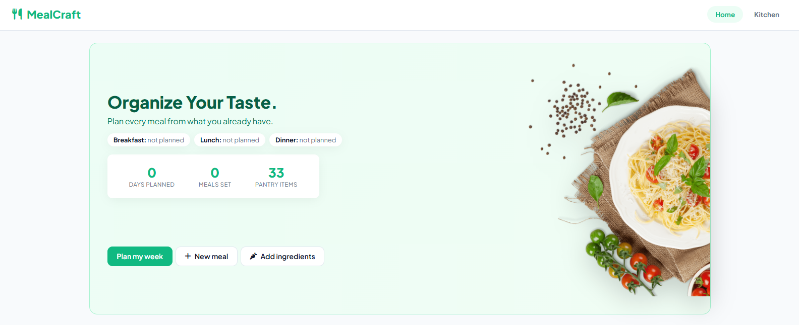

# MealCraft

This is a pantry-in, meal-plan-out planning tool. Add what you already have in your kitchen, build meals from it, and drop those meals into a weekly plan you can print, save as a PDF, or download as an image.

**[Live Demo](https://crypticot.github.io/meal-craft/)**



---

## Why this exists

Most meal planners start from recipes and send you shopping. But most weeks, the real question is simpler: what can I make with what's already here? That answer lives in your head, or in a half-remembered look at the fridge, and by the time you've decided, it's already dinner.

This tool starts from the pantry instead. You list your ingredients once, build a meal from them once, and reuse it in any slot with a single tap. The plan for the week becomes a grid you can see, copy forward, and print, rather than a decision you remake every day.

It also assumes your plan never needs to leave your browser. There's no server in this tool, no account, nothing to sign up for. Your pantry, meals, and plan are stored locally on your device.

---

## What it does

- **Pantry**: add ingredients one at a time or several at once, separated by commas; duplicates are skipped, and each ingredient can have a picture you choose yourself
- **My Meals**: build a meal once from your pantry items, then reuse it anywhere; a meal without its own photo shows its first ingredient's picture
- **Weekly planner**: plan Breakfast, Lunch, and Dinner for every day of the week, with today highlighted, week-by-week navigation, and a one-click "Copy to next week"
- **Custom meal slots**: rename slots, remove them, or add your own like Snack; planned meals follow a renamed slot and are cleared when a slot is removed
- **Quick meal creation from the planner**: tap an empty slot, create a new meal on the spot, and it's saved to your library and assigned in one step
- **Home overview**: today's meals at a glance, plus counts of days planned, meals set, and pantry items
- **Picture picker**: search TheMealDB and Wikipedia for a picture (and Pexels too, if you add a free API key), upload your own photo, or paste an image link; each result shows its source so you can check it before choosing
- **Starter foods**: load ready-made ingredients and meals by country from `starter-foods.json`, untick anything you don't want, and optionally pull in pictures where the file gives an exact source
- **Output grid**: pick a date range and print it, save it as a PDF, or download it as a PNG image
- **Save and import**: export your whole plan as a `.json` file and import it on another device
- **Mobile layout**: on small screens the planner switches to a day-by-day strip instead of a seven-column grid

---

## Tech stack

Built entirely in vanilla HTML, CSS, and JavaScript. Just open `index.html`.

- [html2canvas](https://html2canvas.hertzen.com/): turns the output grid into a downloadable PNG
- [Font Awesome](https://fontawesome.com/): icons
- Google Fonts: Plus Jakarta Sans

Picture search uses [TheMealDB](https://www.themealdb.com/), [Wikipedia](https://www.wikipedia.org/), and optionally [Pexels](https://www.pexels.com/api/). Hosted on GitHub Pages.

---

## Running it locally

```bash
git clone https://github.com/crypticot/meal-craft.git
cd meal-craft
```

Open `index.html` in any browser. No dependencies to install, no build step.

If you open the file straight from a folder, the browser may block `starter-foods.json` from loading automatically. In that case the Starter foods dialog lets you choose the file by hand. Running a local server avoids this:

```bash
python3 -m http.server 8000
```

Then open http://localhost:8000.

---

## Project structure

```
index.html            App markup, styles, and logic (single file)
plate.png             Hero image on the home page
starter-foods.json    Starter ingredients and meals by country
og-image.jpg          Social sharing preview (1200x630)
favicon.ico, favicon.svg, favicon-32x32.png
apple-touch-icon.png  iOS home screen icon
icon-192.png, icon-512.png, site.webmanifest
```

`starter-foods.json` maps a country to its ingredients and meals:

```json
{
  "Nigeria": {
    "ingredients": [{ "name": "Garri", "wiki": "Garri" }],
    "meals": [{ "title": "Jollof rice", "items": ["Rice", "Tomato", "Onion"], "wiki": "Jollof rice" }]
  }
}
```

`items` lists ingredient names, and any not already in the pantry are added automatically. `wiki` (a Wikipedia page title) or `img` (an image URL) is optional and is only used when the user leaves "Add pictures" ticked.

---

## A few design decisions worth knowing

**Why the pantry comes first.** Starting from ingredients rather than recipes means a meal is just a named set of things you already own. That keeps building a meal fast, and it means the planner never asks you for information you haven't already given it.

**Why pictures are never attached automatically.** Searching an image source for a word like "garri" or "pap" can easily return the wrong thing. So the picker shows each result with its source caption and waits for you to choose, rather than quietly attaching whatever came back first. Starter foods only fetch pictures when the file names an exact source, and you can change any of them later.

**Why everything lives in the browser.** Storing the plan in `localStorage` means no account, no sync service, and nothing to go offline. The tradeoff is that clearing your browser data erases the plan, which is why saving to a `.json` file is built in and sits on the home page. Chosen pictures are also shrunk to fit before saving so the browser's storage limit lasts longer.

**Why importing asks before it replaces anything.** An imported file replaces your current pantry, meals, and plan wholesale. A confirmation prompt first, and the same for reset and for deleting a meal or ingredient, keeps a stray click from wiping out a week of planning.

---

## Built by

**Chidubem Ojukwu** · [Portfolio](https://crypticot.github.io/cotworks-portfolio/) · [LinkedIn](https://linkedin.com/in/ojukwuii)

Exists as a tool for anyone who wants to plan their meals from what they already have, without creating an account or sending their data anywhere.
